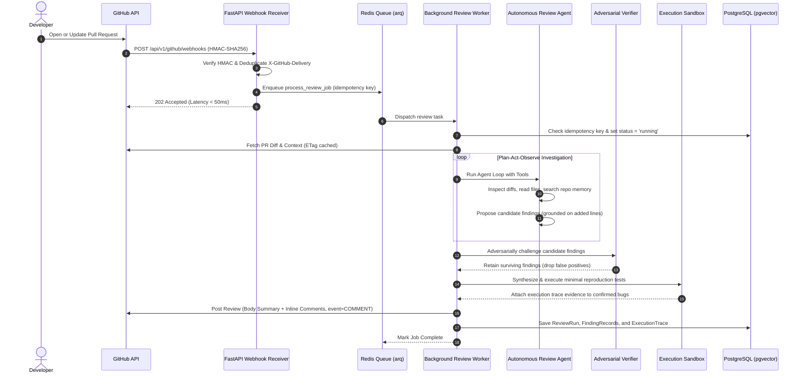

# Autonomous PR Review Agent: System Architecture (Phase 6)

**Document Status:** Production Approved  
**Version:** 2.0  
**Phase:** Phase 6 (Infrastructure & Service Backbone)

---

## 1. Executive Overview

The **Autonomous PR Review Agent** is an enterprise-grade GitHub App designed to inspect pull requests, gather deep repository context via read-only tools, prove defects experimentally in execution sandboxes, and post precise inline comments grounded on exact diff lines.

Unlike naive bots that run single-turn prompts, this service is architectured around:
1. **Decoupled Asynchronous Processing:** Webhooks return HTTP 202 in under 50ms; workloads run asynchronously in Redis-backed queue workers.
2. **Deterministic Diff Grounding:** Line numbers are validated against unified diff added-line maps before any comment is posted.
3. **Devil's Advocate Adversarial Verification:** Proposed findings are challenged prior to publication to eliminate false positives.
4. **Multi-Tenant Partitioning:** Database tables enforce tenant and repository isolation, preventing cross-tenant data leaks.
5. **Strict Non-Governance:** Reviews strictly use the `COMMENT` event—human engineers retain absolute merge authority.

---

## 2. Container & Service Architecture

```mermaid
flowchart TD
    subgraph GitHub ["GitHub Infrastructure"]
        GHApp[GitHub App / Event Stream]
        GHChecks[PR Inline Reviews]
    end

    subgraph Edge ["FastAPI Webhook & REST API"]
        FastAPI[FastAPI Application]
        HMAC[HMAC-SHA256 Validator]
        Deduplicator[Delivery Deduplicator]
        RoutesWebhooks[/api/v1/github/webhooks]
        RoutesReviews[/api/v1/reviews]
        RoutesRepos[/api/v1/repos]
        Dashboard[/dashboard & /metrics]
    end

    subgraph Queues ["Message & Task Queue"]
        Redis[(Redis 7)]
    end

    subgraph Workers ["arq Async Review Workers"]
        WorkerPool[Worker Pool Process]
        AgentEngine[Agent Plan-Act-Observe Loop]
        Verifier[Adversarial Finding Verifier]
        Sandbox[Execution Sandbox Runner]
        Publisher[GitHub Review Publisher]
    end

    subgraph Storage ["Persistent Relational Database"]
        Postgres[(PostgreSQL 16 + pgvector)]
    end

    GHApp -->|Webhook Event| RoutesWebhooks
    RoutesWebhooks --> HMAC
    HMAC --> Deduplicator
    Deduplicator -->|Enqueue Task| Redis
    Deduplicator -->|202 Accepted| GHApp

    Redis -->|Pull Task| WorkerPool
    WorkerPool --> AgentEngine
    AgentEngine --> Verifier
    Verifier --> Sandbox
    Sandbox --> Publisher
    Publisher -->|Post Inline Comments| GHChecks

    WorkerPool -->|Persist Runs, Findings, Traces| Postgres
    RoutesReviews -->|Read Runs & Traces| Postgres
    RoutesRepos -->|Read/Update Repo Settings| Postgres
    Dashboard -->|Read Observability Metrics| Postgres
```

---

## 3. End-to-End Review Sequence Diagram



---

## 4. Multi-Tenant Data Isolation & Security

1. **Tenant Boundaries:**
   - Every repository is owned by a specific `Tenant` (GitHub Organization).
   - Foreign key constraints with `ON DELETE CASCADE` ensure that all repositories, reviews, findings, and traces belong to a single organization boundary.
2. **Idempotency Guarantees:**
   - Idempotency key format: `review:{owner}/{repo}:{pull_number}:{head_sha}`.
   - Prevents duplicate webhook deliveries or rapid git pushes from triggering duplicate model inference.
3. **Non-Governance Override:**
   - The review publishing client programmatically enforces `event = "COMMENT"`.
   - Even if requested otherwise, the bot cannot approve, reject, or block pull requests.
