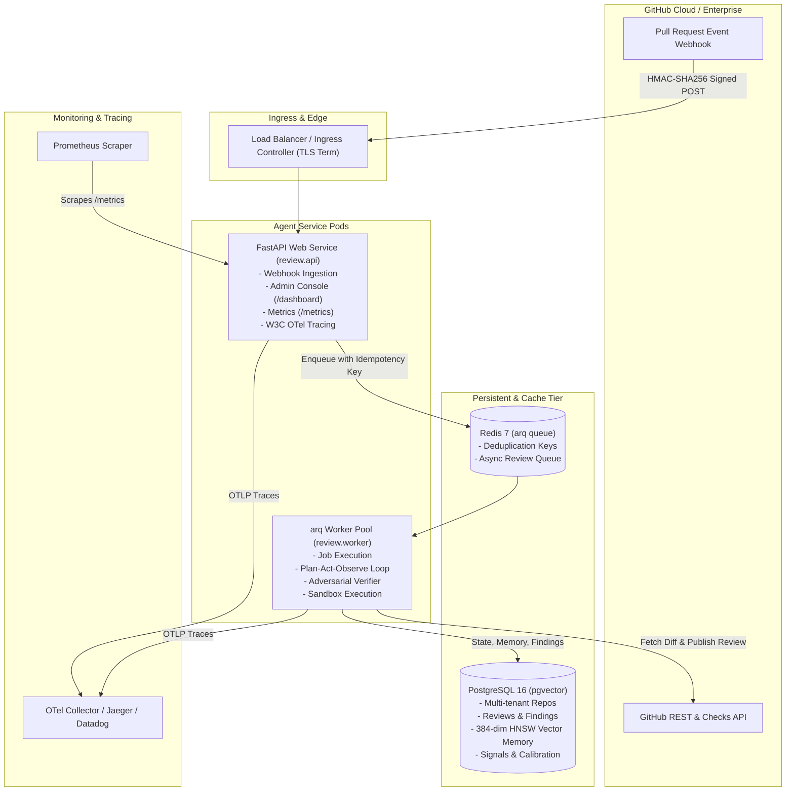

# Production Operations Runbook: Autonomous PR Review Agent

**Service:** `review-agent`  
**Classification:** Tier 1 Engineering Productivity & Security Infrastructure  
**Version:** 0.2.0  
**Target Environments:** Kubernetes, Docker Compose, Bare-Metal Linux  

---

## 1. System Architecture & Topology

The Autonomous PR Review Agent runs as a distributed, event-driven microservices architecture:



---

## 2. Environment Variable Configuration Matrix

| Variable | Description | Default | Sensitivity |
| :--- | :--- | :--- | :--- |
| `DATABASE_URL` | PostgreSQL connection string with asyncpg dialect (`postgresql+asyncpg://...`) | *None (Required)* | **CRITICAL (Secret)** |
| `REDIS_URL` | Redis connection URL for task queue (`redis://localhost:6379/0`) | `redis://localhost:6379/0` | Low |
| `GITHUB_APP_ID` | GitHub App numeric Identifier | *None (Required)* | Low |
| `GITHUB_PRIVATE_KEY` | Raw RSA private key PEM string or base64 PEM for JWT generation | *None (Required)* | **CRITICAL (Secret)** |
| `GITHUB_PRIVATE_KEY_PATH` | Path to RSA private key `.pem` file (alternative to `GITHUB_PRIVATE_KEY`) | `None` | High |
| `GITHUB_WEBHOOK_SECRET` | Secret token configured in GitHub App settings for HMAC-SHA256 signature verification | *None (Required)* | **CRITICAL (Secret)** |
| `GROQ_API_KEY` | API key for LLM inference (Groq Cloud API) | *None (Required)* | **CRITICAL (Secret)** |
| `GROQ_MODEL` | LLM model identifier | `openai/gpt-oss-120b` | Low |
| `OTEL_EXPORTER_OTLP_ENDPOINT` | Base URL for OpenTelemetry OTLP collector | `http://localhost:4318` | Low |
| `OTEL_EXPORTER_OTLP_TRACES_ENDPOINT` | Dedicated OTLP JSON endpoint for traces | `${OTEL_EXPORTER_OTLP_ENDPOINT}/v1/traces` | Low |
| `SANDBOX_TIMEOUT_SECONDS` | Maximum allowed runtime for isolated reproduction test execution | `30` | Low |
| `MAX_DIFF_FILES` | Hard ceiling of modified files per PR to prevent denial-of-service on huge changes | `50` | Low |

---

## 3. Database & pgvector Administration

### 3.1 Automated Zero-Downtime Alembic Migrations
All schema updates are managed via Alembic database migrations:

```bash
# Verify pending migrations without applying
.venv/bin/alembic current

# Run migrations to head
.venv/bin/alembic upgrade head

# Rollback one migration step in emergency
.venv/bin/alembic downgrade -1
```

### 3.2 PostgreSQL pgvector Backup & Restore
The `repo_precedents` table stores 384-dimensional vector embeddings with HNSW cosine distance indexes. The backup procedure preserves vector definitions and HNSW indexes:

```bash
# Comprehensive backup preserving custom vector extension and HNSW indexes
pg_dump -h db.internal -U postgres -d review_agent \
  -Fc --compress=9 -f "review_agent_backup_$(date +%Y%m%d_%H%M%S).dump"

# Restore procedure to fresh instance
createdb -h db.internal -U postgres review_agent
psql -h db.internal -U postgres -d review_agent -c "CREATE EXTENSION IF NOT EXISTS vector;"
pg_restore -h db.internal -U postgres -d review_agent --clean --if-exists \
  "review_agent_backup_20261007_120000.dump"
```

### 3.3 Routine HNSW Vector Index Maintenance
To maintain sub-10ms similarity search latency on large precedent stores, run maintenance during off-peak hours:

```sql
-- Vacuum analyze memory and precedent tables
VACUUM (ANALYZE, VERBOSE) repo_precedents;

-- Reindex HNSW index to reorganize index graph after heavy deletions/updates
REINDEX INDEX CONCURRENTLY ix_repo_precedents_embedding_hnsw;
```

---

## 4. Key & Secret Rotation Procedures

### 4.1 GitHub App Private Key Rotation (Zero Downtime)
1. Go to **GitHub App Settings** -> **General** -> **Private keys**.
2. Click **Generate a private key**. A new `.pem` file will be downloaded.
3. Keep the old private key active in GitHub (GitHub allows multiple active keys).
4. Update Kubernetes Secret or Docker environment with the new `.pem`:
   ```bash
   kubectl create secret generic github-app-credentials \
     --from-file=private-key.pem=./new_app_key.pem \
     --dry-run=client -o yaml | kubectl apply -f -
   ```
5. Perform rolling restart of the web and worker pods:
   ```bash
   kubectl rollout restart deployment/review-agent-web
   kubectl rollout restart deployment/review-agent-worker
   ```
6. Trigger a test review or health probe and verify successful authentication logs.
7. Return to GitHub App Settings and delete the old private key.

### 4.2 GitHub Webhook Secret Rotation
1. Generate high-entropy secret string:
   ```bash
   python -c "import secrets; print(secrets.token_hex(32))"
   ```
2. Update the environment variable `GITHUB_WEBHOOK_SECRET` in secret manager and apply rolling deployment.
3. Immediately update the **Webhook secret** field in GitHub App settings.

---

## 5. Incident Response Playbooks

### Playbook 1: Spike in False Positives
**Severity:** P2  
**Symptoms:** Developers reacting negative emojis (`-1`, `confused`) or filing tickets regarding noisy, non-critical comments.

1. **Immediate Rule Silencing via Web Console:**
   - Navigate to `/dashboard` -> **Tab 4: Memory & Signals Calibration**.
   - Select the affected repository.
   - Locate the offending rule (e.g. `rule:cve-sql-inject` or `category:style`).
   - Click **Silence Rule**. The change takes effect immediately (0s propagation time).
2. **Tighten Verifier Threshold via Repositories Tab:**
   - In `/dashboard` -> **Tab 3: Repositories & Settings**, update repository sensitivity from `aggressive` to `conservative`.
3. **Trace Root-Cause Analysis:**
   - Open **Tab 2: Reviews & Trace Waterfall**.
   - Inspect the waterfall timeline for rejected vs surviving findings.
   - Check LLM rationale and adversarial verifier verdict.

---

### Playbook 2: Redis Worker Queue Backlog
**Severity:** P1  
**Symptoms:** Reviews take > 5 minutes to post; Prometheus alert `ReviewAgentQueueLag` fires.

1. **Check Queue Depth & Health:**
   ```bash
   redis-cli -u $REDIS_URL LLEN arq:queue
   ```
2. **Inspect Worker Pod Logs:**
   ```bash
   kubectl logs -l app=review-agent-worker --tail=100 -f
   ```
3. **Scale Worker Concurrency:**
   ```bash
   kubectl scale deployment/review-agent-worker --replicas=8
   ```
4. **Verify Idempotency Deduplication:**
   Every review task key has format `review:{repo}:{head_sha}`. If duplicate webhooks are received for the same push, the worker safely skips processing via database unique constraint on `ReviewRun.idempotency_key`.

---

### Playbook 3: LLM Provider Rate Limiting (HTTP 429) or Outage
**Severity:** P1  
**Symptoms:** Worker logs display `Groq rate limit encountered` or `LLMReviewError`; alert `ReviewAgentHighErrorRate` triggers.

1. **Switch Model to High-Throughput Fallback:**
   - Update `GROQ_MODEL=openai/gpt-oss-20b` (faster inference, higher tokens-per-minute quota).
   ```bash
   kubectl set env deployment/review-agent-worker GROQ_MODEL="openai/gpt-oss-20b"
   ```
2. **Verify Exponential Backoff:**
   The `GroqReviewer` handles `RateLimitError` with exponential backoff:
   $$T_{\text{wait}} = \text{backoff\_seconds} \times 2^{(\text{attempt}-1)}$$
   No manual restart is required unless API tokens are exhausted.

---

### Playbook 4: Sandbox Container Execution Timeout / Stalls
**Severity:** P2  
**Symptoms:** Reproduction tests taking > 30s; worker CPU utilization spiking.

1. **Safety Guarantee:**
   The `SandboxRunner` enforces a hard sub-process timeout (`SANDBOX_TIMEOUT_SECONDS=30`) and terminates rogue processes with `SIGKILL`.
2. **Check Audit Log:**
   Verify reproduction script code in the Web Console modal:
   - Navigate to `/dashboard` -> **Tab 2: Reviews**.
   - Click **🔍 Inspect** on the flagged review.
   - Expand the **Inline Findings & Evidence** section to inspect the synthesized test script and stdout/stderr output.

---

## 6. Prometheus Metric Alerts Specification

Save the following Prometheus rule definition to `/etc/prometheus/rules/review_agent.rules.yml`:

```yaml
groups:
  - name: review_agent_alerts
    rules:
      - alert: ReviewAgentHighErrorRate
        expr: (rate(pr_reviews_failed_total[5m]) / rate(pr_reviews_total[5m])) > 0.05
        for: 5m
        labels:
          severity: critical
        annotations:
          summary: "High review failure rate (> 5%)"
          description: "Over 5% of PR reviews failed during the last 5 minutes. Check worker logs and LLM API connectivity."

      - alert: ReviewAgentQueueLag
        expr: arq_queue_size > 50
        for: 10m
        labels:
          severity: warning
        annotations:
          summary: "Review worker queue backlog (> 50 jobs)"
          description: "Redis queue depth exceeds 50 jobs for 10 minutes. Consider scaling review-agent-worker replicas."

      - alert: ReviewAgentHighP99Latency
        expr: pr_review_duration_ms_p99 > 60000
        for: 10m
        labels:
          severity: warning
        annotations:
          summary: "Review duration P99 exceeds 60s"
          description: "P99 latency has exceeded 60 seconds over the last 10m. Check AST analysis and sandbox execution duration."

      - alert: ReviewAgentLowPrecisionAlert
        expr: pr_finding_false_positive_filter_rate < 0.20
        for: 30m
        labels:
          severity: info
        annotations:
          summary: "Low verifier filter rate (< 20%)"
          description: "Adversarial verifier is filtering fewer than 20% of generated findings. Review verifier prompt sensitivity."
```
